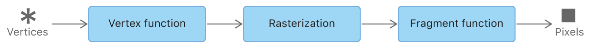

2024-03-07
在网页（https://xiaozhuanlan.com/star）看了 Data Type 类型，有了一个基本的了解，对应 2、3、4 维的数据

2024-03-12
1. MTKView 需要指定一个 Metal device，便于内部创建资源，所以第一步就是创建 device
`_view.device = MTLCreateSystemDefaultDevice();`
2. 属性的设置，比如 clearColor
3. 代理（MTKViewDelegate）设置
3.1 代理方法  mtkView(_:drawableSizeWillChange:)，size 变化时会被调用，比如横屏时
3.2 代理方法 draw(in:) whenever it’s time to update the view’s contents. In this method, you create a command buffer, encode commands that tell the GPU what to draw and when to display it onscreen, and enqueue that command buffer to be executed by the GPU. This is sometimes referred to as drawing a frame. You can think of a frame as all of the work that goes into producing a single image that gets displayed on the screen. In an interactive app, like a game, you might draw many frames per second.

2024-03-13
 The vertex stage and fragment stage are programmable, so you write functions for them in Metal Shading Language (MSL). The rasterization stage has fixed behavior.  
